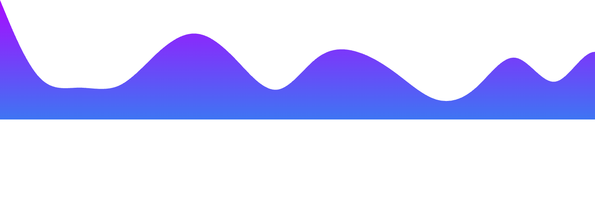

<h1 align="center">Hi, I'm George 👋</h1>

    

### Who am I 🧑🏻

I'm a software engineer focused on delivering secure, scalable, and
efficient code. I'm currently a Founding Engineer at @hostile, where I 
work to create a more secure internet.

### Skills ⌨️

While I'm focused on web development, my skills span across
multiple stacks and countless languages. Here's what I work best with:

Languages - Java, C++, Python, JavaScript / TypeScript, PHP, Dart
 
Backend - Express.js, Flask, Spring, Laravel
 
Frontend - HTML / CSS, React.js / Next.js, Flutter, TailwindCSS
 
Databases - SQL (MySQL, PostgreSQL, SQL Server, SQLite3), MongoDB
 
Extra - Redis, AWS, CI/CD, REST, JVM Bytecode, Websockets, Microservices,
Docker, Linux, Agile / SCRUM

### Contact 🌐

Feel free to reach out and ask me about any of my projects, or for
help with your own.

I can be reached via email at <a href="mailto:george@hostile.org">george@hostile.org</a>.

My portfolio site can be seen at <a href="https://george.hostile.org">george.hostile.org</a>

